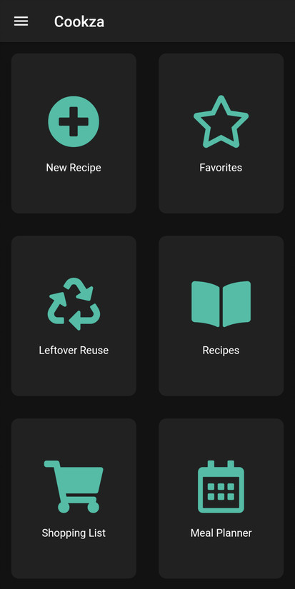

# Cookza

Cookza is a flutter app which let's you store and share your favorite recipes.

## Building the app

### Generating translations
Needed to generate for first run after checkout as the generated classes are not checked in.
* flutter gen-l10n

### Generating models
* flutter pub run build_runner build --delete-conflicting-outputs

### Building Android APK
Run the following command to built an APK for ARM64
* flutter build apk --target-platform android-arm64 --split-per-abi
* flutter run --release to run the release build on a device

### Generate icons
* flutter pub run flutter_launcher_icons:main -f flutter_launcher_icons.yaml

### Deploy web app
* firebase hosting:channel:deploy <channel>

## Running tests
* flutter test --coverage
* genhtml coverage/lcov.info --output-directory coverage
